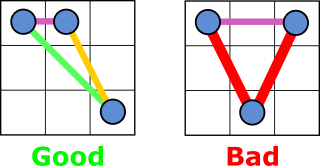

This is a program that solves the following problem:

* On a grid of size NxN find how to place N dots (placing them in the middles of the squares), such that every pair of dots has an unique distance between them
* Mutually mirrored/rotated board layouts are considered to be the same
* Find what is the maximum board side, so that it's possible to find such a placement. How many placements are out there for this board?

An example output of the program:

~~~
Side: 3, Layouts: 5.  Time used: 0ms
|OO.|OO.|OO.|OO.|O..|
|..O|...|...|...|.OO|
|...|O..|.O.|..O|...|
Side: 4, Layouts: 23.  Time used: 0ms
|OO..|OO..|OO..|OO..|OO..|OO..|OO..|OO..|OO..|OO..|OO..|OO..|O.O.|O.O.|O.O.|O..O|O..O|O..O|O...|O...|.OO.|.OO.|.OO.|
|..O.|..O.|...O|....|....|....|....|....|....|....|....|....|..O.|...O|...O|.O..|....|....|.O.O|...O|O...|....|....|
|....|....|....|O..O|O...|O...|.O..|.O..|..O.|..O.|...O|....|....|...O|....|....|.O..|.O..|...O|..O.|....|O...|.O..|
|O...|..O.|...O|....|.O..|...O|O...|..O.|.O..|...O|.O..|.O.O|O...|....|..O.|.O..|.O..|..O.|....|..O.|..O.|.O..|..O.|
Side: 5, Layouts: 35.  Time used: 1ms
|OO..O|OO..O|OO...|OO...|OO...|OO...|OO...|OO...|OO...|OO...|OO...|OO...|OO...|OO...|OO...|OO...|OO...|O.OO.|O.O..|O.O..|O.O..|O.O..|O.O..|O.O..|O.O..|O.O..|O..O.|O..O.|O..O.|O...O|O....|O....|.OO..|.OO..|.O...|
|.....|.....|..O.O|..O..|..O..|..O..|..O..|...O.|....O|....O|.....|.....|.....|.....|.....|.....|.....|.....|..O..|...OO|...O.|.....|.....|.....|.....|.....|.O...|.....|.....|.O...|.O..O|.O..O|O....|.....|O....|
|.O...|...O.|.....|.....|.....|.....|.....|.....|...O.|.....|O..O.|O....|O....|.O...|.....|.....|.....|.....|.....|.....|.....|....O|....O|.....|.....|.....|.....|.....|.....|.O...|.....|.....|.....|.O...|...OO|
|.....|.....|.....|O....|.....|.....|.....|.....|.....|...O.|....O|...O.|...O.|O....|..O..|..O..|...O.|....O|.....|.....|....O|..OO.|...O.|O....|..OO.|...OO|.....|.O...|.O...|.....|...OO|...O.|..O.O|....O|.....|
|...O.|...O.|....O|....O|O..O.|.O..O|..O.O|.O.O.|....O|....O|.....|..O..|....O|....O|O..O.|.O..O|.O..O|..O..|O..O.|O....|O....|.....|...O.|..OO.|....O|..O..|..OO.|.O.O.|..OO.|.O...|.....|...O.|.....|...O.|...O.|
Side: 6, Layouts: 2.  Time used: 9ms
|OO....|O.O..O|
|...O..|......|
|......|......|
|.....O|...O..|
|......|....O.|
|..O..O|....O.|
Side: 7, Layouts: 1.  Time used: 63ms
|O.O....|
|..O....|
|......O|
|O......|
|.......|
|.....O.|
|......O|
Side: 8, Layouts: None.  Time used: 581ms
Side: 9, Layouts: None.  Time used: 4213ms
Side: 10, Layouts: None.  Time used: 35949ms
Side: 11, Layouts: None.  Time used: 261165ms
Side: 12, Layouts: None.  Time used: 2090329ms
~~~

7x7 is the maximum board that has such a placement, and there is a single possible layout.

Starting from 16x16 it can be proven analytically that it's not possible to find such a placement that would satisfy the requirements.